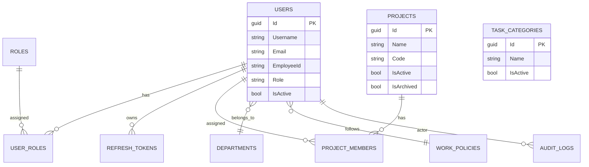

# ERD (Sprint 0)

```mermaid
erDiagram
  USERS ||--o{ USER_ROLES : has
  ROLES ||--o{ USER_ROLES : assigned
  USERS ||--o{ REFRESH_TOKENS : owns
  USERS ||--o{ PROJECT_MEMBERS : assigned
  PROJECTS ||--o{ PROJECT_MEMBERS : has
  USERS }o--|| DEPARTMENTS : belongs_to
  USERS }o--|| WORK_POLICIES : follows
  USERS ||--o{ AUDIT_LOGS : actor

  USERS {
    guid Id PK
    string Username
    string Email
    string EmployeeId
    string Role
    bool IsActive
  }
  PROJECTS {
    guid Id PK
    string Name
    string Code
    bool IsActive
    bool IsArchived
  }
  TASK_CATEGORIES {
    guid Id PK
    string Name
    bool IsActive
  }
```
